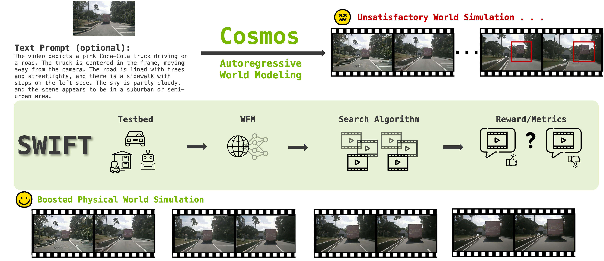

# WFM-TTS: Test-Time Scaling for World Foundation Models 🚀

Official repository for the paper [**Can Test-Time Scaling Improve World Foundation Models?**](https://arxiv.org/abs/2503.24320)

[[🔖 Project Page](https://scalingwfm.github.io/)] [[📄 Paper](https://arxiv.org/abs/2503.24320)]

## 🚀 News
- **[2025.07]** Paper is accepted by COLM 2025!
- **[2025.04]** Test-time scaling code released!
- **[2025.04]** [Project website](https://scalingwfm.github.io) is live! 
- **[2025.03]** Paper released on [arXiv](https://arxiv.org/abs/2503.24320)!


## 🔍 What is WFM-TTS?
**WFM-TTS** is the **first test-time scaling framework for World Foundation Models (WFMs)**. Instead of retraining or enlarging models, WFM-TTS improves performance at inference time using smart generation strategies. It:

- Enables small models (e.g., 4B) to match or outperform large models (e.g., 12B)
- Works under the same compute budget
- Requires no weight updates or additional training

<p align="center">
     <br>
</p>

## 📊 Evaluation Toolkit
We introduce a **modular and extensible evaluation toolkit** to assess WFM performance across:
- ✔ 3D consistency
- ✔ Temporal consistency
- ✔ Spatial relationship awareness
- ✔ Perceptual quality
- ✔ Text-to-video alignment

This toolkit provides rigorous benchmarking for generated videos across physical and semantic fidelity.

## 🔧 Key Techniques in WFM-TTS
WFM-TTS integrates multiple test-time strategies to boost performance:

1. **Rule-Based Rewards** — Robust and extensible scoring mechanisms
2. **Efficient Tokenizer Decoder** — 9,000x faster than diffusion decoder with consistent trends
3. **Probability-Based Top-K Pruning** — Balances exploration and quality
4. **Beam Search Integration** — Enhances diversity and reliability

## 📊 Results at a Glance
- A 4B WFM + WFM-TTS achieves **better or equal** performance to a 12B model
- Human evaluations favor WFM-TTS-enhanced outputs over larger baselines


## 🚧 Installation

### Environment Setup
```bash
git clone https://github.com/Mia-Cong/WFM-TTS.git
cd WFM-TTS
```
> Base model Cosmos runs only on Linux systems. It has been tested with Ubuntu 20.04, 22.04, and 24.04. Python 3.10.x and conda are required.

### Inference Setup
Run the following to set up the conda environment and install dependencies:
```bash
# Create the WFM-TTS conda environment
conda env create --file wfmtts.yaml

# Activate the environment
conda activate wfmtts

# Install Python dependencies
pip install -r requirements.txt

# Patch Transformer engine linking issues in conda environments
ln -sf $CONDA_PREFIX/lib/python3.10/site-packages/nvidia/*/include/* $CONDA_PREFIX/include/
ln -sf $CONDA_PREFIX/lib/python3.10/site-packages/nvidia/*/include/* $CONDA_PREFIX/include/python3.10

# Install Transformer engine
pip install transformer-engine[pytorch]==1.12.0
```
To test the environment setup:
```bash
CUDA_HOME=$CONDA_PREFIX PYTHONPATH=$(pwd) python scripts/test_environment.py
```

## 🧪 Test-Time Scaling
To reproduce WFM-TTS's test-time scaling results:

### 1. Download Pretrained Models of Base WFM model COSMOS
- Follow [cosmos_inference_autoregressive_base](https://github.com/nvidia-cosmos/cosmos-predict1/blob/main/examples/inference_autoregressive_base.md) to set up **COSMOS 4B/12B** models.
- Follow [cosmos_inference_autoregressive_video2world](https://github.com/nvidia-cosmos/cosmos-predict1/blob/main/examples/inference_autoregressive_video2world.md) for **COSMOS 5B/13B** models.

### 2. Download Evaluation Dataset
- Download the [900 autonomous driving test sequences](https://drive.google.com/drive/folders/1X5O6vRk81Svh8ztdMxIWIfGKFkE5oT4R?usp=sharing) we prepared using NuScenes dataset and Waymo dataset, and put it under `assets/autoregressive/`

### 3. Run WFM-TTS Scripts
- Run any of the provided test-time scaling scripts located in `scripts/`, for example:
```bash
./scripts/cosmos4b_prob_beam.sh
```

## ✅ Citation
If you find this work useful, please cite:
```bibtex
@inproceedings{cong2025wfm-tts,
  title     = {Can Test-Time Scaling Improve World Foundation Models?},
  author    = {Wenyan Cong and Hanqing Zhu and Peihao Wang and Bangya Liu and Dejia Xu and Kevin Wang and David Z. Pan and Yan Wang and Zhiwen Fan and Zhangyang Wang},
  booktitle = {COLM},
  year      = {2025}
}
```

## 🔗 Related Resources
- [COSMOS](https://github.com/nvidia-cosmos/cosmos-predict1) - World Foundation Model
- [VBench](https://github.com/VBench/VBench) - Benchmark for video generation models


For more updates and demos, visit our website: [https://scalingwfm.github.io](https://scalingwfm.github.io)
